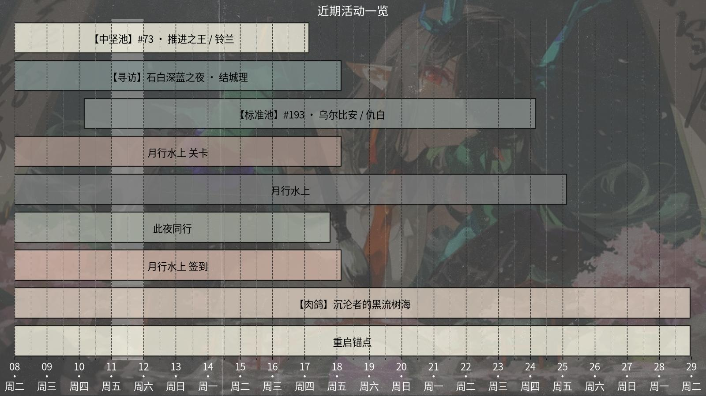

# GanttKnights
针对游戏明日方舟特化的甘特图绘图工具，基于matplotlib | A Gantt chart plotting tool specialized for the mobile game "Arknights", developed using matplotlib.

效果展示


## 使用

```bash
uv sync          # 或 pip install httpx matplotlib pandas Pillow

python main.py            # 生成 Gantt.jpg（数据每天只爬一次）
python main.py --force    # 强制重新爬取
python prts_scraper.py    # 只爬取活动数据并在控制台打印
```

数据全部来自 [PRTS Wiki](https://prts.wiki)：SMW ask 查活动时间、卡池一览与活动公告的 wikitext 解析卡池和子活动，需要网络。

可选素材：`背景图/` 放任意背景图，`纹理/` 放纹理图（自动随机取色配色）；字体 `字体/NotoSansCJKsc-Regular.ttf` 不在仓库里，缺失时会回退到系统中文字体。
